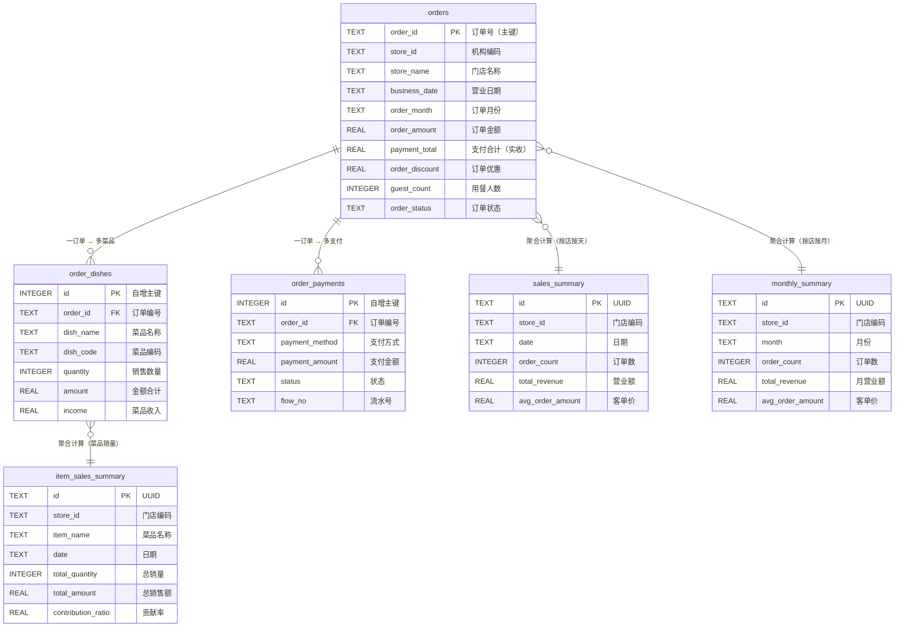

# 美团餐饮数据系统 · 快速参考

## 启动方式

```bash
node main.js              # 完整启动（导入已有Excel + 启动服务 + 定时任务）
node main.js --import     # 仅导入 downloads/ 下的 Excel，不启动服务

node test_download.js     # 测试：手动触发下载昨天数据（弹出浏览器）
node test_storage.js      # 测试：检查数据库数据是否正常
```

## API 接口（端口 3000）

| 方法 | 路径 | 说明 |
|------|------|------|
| GET | /api/health | 健康检查 |
| GET | /api/status | 系统状态 |
| GET | /api/storage/stats | 数据库各表数据量 |
| GET | /api/storage/files | downloads/ 文件列表及导入状态 |
| POST | /api/storage/test/import | 导入指定文件 `{ filename }` |
| POST | /api/storage/test/import-all | 导入所有未处理文件 |
| POST | /api/storage/test/recalculate | 重算统计 `{ storeId, date }` |

---

## 数据库表结构

### orders · 订单明细表

| 字段 | 中文名 | 类型 | 说明 |
|------|--------|------|------|
| order_id | 订单号 | TEXT PK | 主键，全局唯一 |
| store_id | 机构编码 | TEXT | 如 MD00001 |
| store_name | 门店名称 | TEXT | 如 常青麦香园光谷华科店 |
| business_date | 营业日期 | TEXT | 格式 2026-02-24 |
| order_month | 订单月份 | TEXT | 格式 2026-02，用于月度统计 |
| order_mode | 经营模式 | TEXT | 堂食/外卖等 |
| order_source | 订单来源 | TEXT | |
| dining_type | 用餐方式 | TEXT | |
| order_time | 下单时间 | TEXT | |
| checkout_time | 结账时间 | TEXT | |
| meal_number | 取餐号 | TEXT | |
| table_number | 桌牌号 | TEXT | |
| guest_count | 用餐人数 | INTEGER | |
| order_amount | 订单金额 | REAL | 含优惠前金额 |
| payment_total | 支付合计 | REAL | 实收金额 |
| order_discount | 订单优惠 | REAL | 优惠金额 |
| order_income | 订单收入 | REAL | |
| checkout_method | 结账方式 | TEXT | |
| order_status | 订单状态 | TEXT | 已结账/已退单等 |
| refund_flag | 退单标识 | TEXT | 是/否 |
| dish_income | 菜品收入 | REAL | |
| member | 会员 | TEXT | |
| remark | 整单备注 | TEXT | |

---

### order_dishes · 菜品明细表

| 字段 | 中文名 | 类型 | 说明 |
|------|--------|------|------|
| id | 自增ID | INTEGER PK | 主键 |
| order_id | 订单编号 | TEXT FK | → orders.order_id |
| store_id | 机构编码 | TEXT | |
| store_name | 门店名称 | TEXT | |
| meal_number | 取餐号 | TEXT | |
| table_number | 桌牌号 | TEXT | |
| dish_code | 菜品编码 | TEXT | |
| dish_name | 菜品名称 | TEXT | |
| spec | 规格 | TEXT | |
| method | 做法 | TEXT | |
| topping | 加料 | TEXT | |
| quantity | 销售数量 | INTEGER | |
| unit | 单位 | TEXT | |
| amount | 金额合计 | REAL | |
| discount | 菜品优惠 | REAL | |
| income | 菜品收入 | REAL | |
| remark | 备注 | TEXT | |

> 一个订单可有多条菜品记录（一对多）

---

### order_payments · 支付明细表

| 字段 | 中文名 | 类型 | 说明 |
|------|--------|------|------|
| id | 自增ID | INTEGER PK | 主键 |
| order_id | 订单编号 | TEXT FK | → orders.order_id |
| store_id | 机构编码 | TEXT | |
| store_name | 门店名称 | TEXT | |
| payment_method | 支付方式 | TEXT | 微信/现金/美团等 |
| payment_amount | 支付金额 | REAL | |
| payment_discount | 支付优惠 | REAL | |
| income | 收入 | REAL | |
| payment_time | 支付时间 | TEXT | |
| is_refund | 是否退款 | TEXT | |
| status | 状态 | TEXT | 支付成功等 |
| operator | 操作人 | TEXT | |
| merchant_no | 支付商户号 | TEXT | |
| flow_no | 流水号 | TEXT | |

> 一个订单可有多条支付记录（组合支付，如微信+现金）

---

### sales_summary · 日度营业统计表

| 字段 | 中文名 | 类型 | 说明 |
|------|--------|------|------|
| id | UUID | TEXT PK | |
| store_id | 门店编码 | TEXT | |
| store_name | 门店名称 | TEXT | |
| date | 日期 | TEXT | 格式 2026-02-24 |
| month | 月份 | TEXT | 格式 2026-02 |
| total_revenue | 营业额 | REAL | 订单金额合计 |
| total_sales | 实收合计 | REAL | 支付合计 |
| total_discount | 优惠合计 | REAL | |
| discount_ratio | 优惠率 | REAL | % |
| order_count | 订单数 | INTEGER | |
| avg_order_amount | 客单价 | REAL | |

> 唯一约束：(store_id, date)，每店每天只有一条

---

### monthly_summary · 月度统计表

| 字段 | 中文名 | 类型 | 说明 |
|------|--------|------|------|
| id | UUID | TEXT PK | |
| store_id | 门店编码 | TEXT | |
| store_name | 门店名称 | TEXT | |
| month | 月份 | TEXT | 格式 2026-02 |
| total_revenue | 月营业额 | REAL | |
| total_sales | 月实收 | REAL | |
| total_discount | 月优惠 | REAL | |
| discount_ratio | 优惠率 | REAL | % |
| order_count | 订单数 | INTEGER | |
| avg_order_amount | 客单价 | REAL | |

> 唯一约束：(store_id, month)，每店每月只有一条

---

### item_sales_summary · 菜品销售统计表（按天）

| 字段 | 中文名 | 类型 | 说明 |
|------|--------|------|------|
| id | UUID | TEXT PK | |
| store_id | 门店编码 | TEXT | |
| store_name | 门店名称 | TEXT | |
| item_id | 菜品编码 | TEXT | |
| item_name | 菜品名称 | TEXT | |
| category | 分类 | TEXT | 暂统一为"其他" |
| date | 日期 | TEXT | |
| month | 月份 | TEXT | |
| total_quantity | 总销量 | INTEGER | |
| total_amount | 总销售额 | REAL | |
| total_discount | 总优惠 | REAL | |
| order_count | 出现订单数 | INTEGER | |
| contribution_ratio | 贡献率 | REAL | 占当日菜品总额% |

> 唯一约束：(store_id, item_id, date)，每店每菜每天一条

---

## 表关系图

> 在 VSCode 安装 **Markdown Preview Mermaid Support** 插件后，按 `Ctrl+Shift+V` 预览即可看到渲染后的图形。



## 文件命名规则

| 类型 | 格式 | 示例 |
|------|------|------|
| 月度文件（历史下载） | `YYYY.MM月店内订单明细.xlsx` | `2025.01月店内订单明细.xlsx` |
| 日度文件（每日下载） | `YYYY.MM.DD日店内订单明细.xlsx` | `2026.02.24日店内订单明细.xlsx` |

## 门店编码对照

| 机构编码 | 门店名称 |
|---------|---------|
| MD00001 | 常青麦香园常青十一小区店 |
| MD00005 | 常青麦香园步行街店 |
| MD00006 | 常青麦香园工厂店 |
| MD00007 | 常青麦香园新华路店 |
| MD00008 | 常青麦香园光谷华科店 |
| MD00012 | 常青麦香园蔡甸中百店 |
| MD00017 | 常青麦香园铁机盛世家园店 |
| MD00022 | 常青麦香园东辉花园店 |
