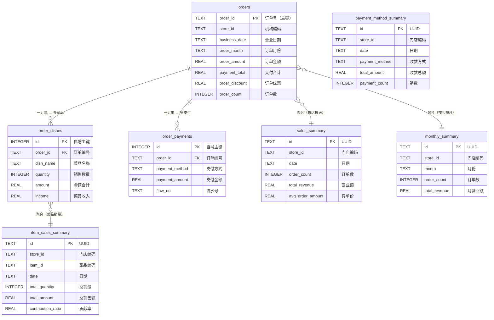

# 美团餐饮数据系统 · 快速参考

## 启动方式

```bash
node main.js              # 完整启动（导入已有Excel + 启动服务 + 定时任务）
node main.js --import     # 仅导入 downloads/ 下的 Excel，不启动服务

node test_download.js     # 测试：手动触发下载三种报表（弹出浏览器）
```

## 文件命名规则

下载器自动生成的文件名格式：

| 类型 | 月度格式 | 日度格式 |
|------|---------|---------|
| 全渠道订单明细 | `2026.01月全渠道订单明细.xlsx` | `2026.02.24日全渠道订单明细.xlsx` |
| 菜品销售明细   | `2026.01月菜品销售明细.xlsx`   | `2026.02.24日菜品销售明细.xlsx`   |
| 收款明细       | `2026.01月收款明细.xlsx`       | `2026.02.24日收款明细.xlsx`       |

**存储层通过文件名自动识别报表类型并路由到对应处理流程，无需手动指定。**

---

## API 接口（端口 3000）

| 方法 | 路径 | 说明 |
|------|------|------|
| GET | /api/health | 健康检查 |
| GET | /api/status | 系统状态 |
| GET | /api/storage/stats | 数据库各表数据量 |
| GET | /api/storage/files | downloads/ 文件列表及导入状态 |
| POST | /api/storage/test/import | 导入指定文件 `{ filename }` |
| POST | /api/storage/test/import-all | 导入所有未处理文件 |
| POST | /api/storage/test/recalculate | 重算统计 `{ storeId, date }` |

---

## 数据库表结构（7张表）

### 来源：全渠道订单明细

#### orders · 订单主表

| 字段 | 中文名 | 类型 | 说明 |
|------|--------|------|------|
| order_id | 订单号 | TEXT PK | 全局唯一主键 |
| store_id | 机构编码 | TEXT | 如 MD00001 |
| store_name | 门店名称 | TEXT | |
| business_date | 营业日期 | TEXT | 格式 2026-02-24 |
| order_month | 订单月份 | TEXT | 格式 2026-02，用于月度统计 |
| order_mode | 经营模式 | TEXT | 堂食/外卖等 |
| order_source | 订单来源 | TEXT | |
| dining_type | 用餐方式 | TEXT | |
| order_time | 下单时间 | TEXT | |
| checkout_time | 结账时间 | TEXT | |
| guest_count | 用餐人数 | INTEGER | |
| order_amount | 订单金额 | REAL | 含优惠前金额 |
| payment_total | 支付合计 | REAL | 实收金额 |
| order_discount | 订单优惠 | REAL | |
| order_status | 订单状态 | TEXT | 已结账/已退单等 |

---

#### order_dishes · 菜品明细表

| 字段 | 中文名 | 类型 | 说明 |
|------|--------|------|------|
| id | 自增ID | INTEGER PK | |
| order_id | 订单编号 | TEXT FK | → orders.order_id |
| store_id | 机构编码 | TEXT | |
| dish_code | 菜品编码 | TEXT | |
| dish_name | 菜品名称 | TEXT | |
| spec / method / topping | 规格/做法/加料 | TEXT | |
| quantity | 销售数量 | INTEGER | |
| amount | 金额合计 | REAL | |
| discount | 菜品优惠 | REAL | |
| income | 菜品收入 | REAL | |

---

#### order_payments · 支付明细表

| 字段 | 中文名 | 类型 | 说明 |
|------|--------|------|------|
| id | 自增ID | INTEGER PK | |
| order_id | 订单编号 | TEXT FK | → orders.order_id |
| store_id | 机构编码 | TEXT | |
| payment_method | 支付方式 | TEXT | 微信/现金/美团等 |
| payment_amount | 支付金额 | REAL | |
| payment_discount | 支付优惠 | REAL | |
| income | 收入 | REAL | |
| flow_no | 流水号 | TEXT | |

---

### 来源：全渠道订单明细（聚合计算）

#### sales_summary · 日度营业统计

| 字段 | 说明 |
|------|------|
| store_id + date | 唯一约束，每店每天一条 |
| total_revenue | 营业额（订单金额合计） |
| total_sales | 实收合计（支付合计） |
| total_discount | 优惠合计 |
| discount_ratio | 优惠率 % |
| order_count | 订单数 |
| avg_order_amount | 客单价 |

#### monthly_summary · 月度统计

| 字段 | 说明 |
|------|------|
| store_id + month | 唯一约束，每店每月一条 |
| 其余字段同 sales_summary | 月度汇总 |

---

### 来源：菜品销售明细（直接写入）

#### item_sales_summary · 菜品销售统计（按天）

| 字段 | 说明 |
|------|------|
| store_id + item_id + date | 唯一约束，每店每菜每天一条 |
| item_id | 菜品编码（无编码时用名称） |
| item_name | 菜品名称 |
| category | 菜品分类 |
| total_quantity | 总销量 |
| total_amount | 总销售额 |
| total_discount | 总优惠 |
| contribution_ratio | 贡献率（占当日菜品总额%） |

> 数据来源优先级：**菜品销售明细 Excel** > 全渠道订单明细聚合计算
> （两者都有时，菜品销售明细会通过 INSERT OR REPLACE 覆盖计算值）

---

### 来源：收款明细（按门店/日期/方式聚合）

#### payment_method_summary · 收款方式汇总

| 字段 | 说明 |
|------|------|
| store_id + date + payment_method | 唯一约束 |
| payment_method | 收款方式（微信/支付宝/现金/美团券等） |
| total_amount | 收款总额 |
| total_discount | 优惠总额 |
| total_income | 实收总额 |
| payment_count | 收款笔数 |

> 用途：饼图/柱图展示各支付方式占比

---

## 表关系图



---

## 门店编码对照

| 机构编码 | 门店名称 |
|---------|---------|
| MD00001 | 常青麦香园常青十一小区店 |
| MD00005 | 常青麦香园步行街店 |
| MD00006 | 常青麦香园工厂店 |
| MD00007 | 常青麦香园新华路店 |
| MD00008 | 常青麦香园光谷华科店 |
| MD00012 | 常青麦香园蔡甸中百店 |
| MD00017 | 常青麦香园铁机盛世家园店 |
| MD00022 | 常青麦香园东辉花园店 |

---

## 存储层处理流程

```
downloads/*.xlsx
     │
     ├── 全渠道订单明细 ──→ orders + order_dishes + order_payments
     │                  └─→ sales_summary（日度汇总）
     │                  └─→ monthly_summary（月度汇总）
     │                  └─→ item_sales_summary（菜品统计，可被覆盖）
     │
     ├── 菜品销售明细 ────→ item_sales_summary（直接写入，优先级更高）
     │
     └── 收款明细 ────────→ payment_method_summary（按支付方式聚合）
```

**去重逻辑：** 三种文件类型独立判断，同月份 × 同类型 = 跳过（幂等导入）
